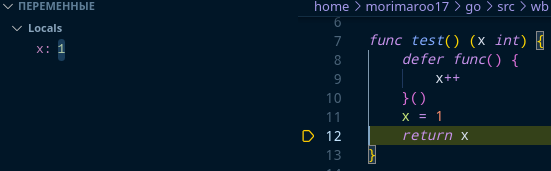

Что выведет программа? Объяснить вывод программы. Объяснить как работают defer’ы и их порядок вызовов.

```go
package main
import (
	"fmt"
)
func test() (x int) {
	defer func() {
		x++
	}()
	x = 1
	return
}
func anotherTest() int {
	var x int
	defer func() {
		x++
	}()
	x = 1
	return x
}
func main() {
	fmt.Println(test())
	fmt.Println(anotherTest())
}
```

Ответ:
```
Вывод программы:
2
1
В Go функция, объявленная при помощи defer, может получить доступ к именованному возвращаемому значению и	изменить его перед самым выходом из функции.
В функции anotherTest именованное значение отстутствует, поэтому его инкремент не повлияет на возвращаемое значение.
В test же x является именованным возвращаемым значением, соответственно до выхода из функции мы можем его изменить.
В первом случае Х был инициализирован при объявлении возвращаемого значения и вернется именно он. Во втором же случае вернется копия Х, которая перед вызовом
defer – инструкции уже скопирована в return. – из дебага:
```
# Первая функция
## Аллокация X

## Возвращаемый X перед вызовом defer 

## Обновление значения X после вызова defer

# Вторая функция
## Аллокация возвращаемого значения

# Перед вызовом defer в возвращаемое значение уже занесено значение X

# После вызова defer X был инкрементирован, а возвращаемое значение нет
